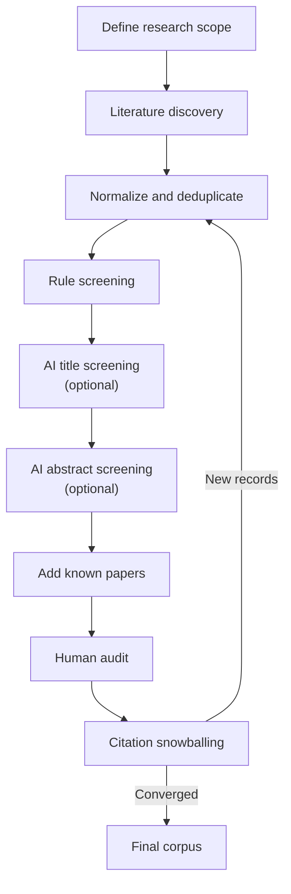

# SurveyFlow

[English](#english) | [中文](#中文) | [日本語](#日本語) | [한국어](#한국어)

SurveyFlow is a local graphical workspace for building an auditable literature
survey. It combines multi-source discovery, deterministic filtering, abstract
enrichment, optional AI recommendations, mandatory human review, citation
snowballing, final export, PDF question answering, and corpus classification.

## Workflow



AI screening is optional and produces recommendations only. A human reviewer
makes the final inclusion decision in the initial discovery round and every
snowballing round. The Run Center records the number of papers entering,
leaving, and remaining after each stage. Venue and abstract enrichment still run
but are intentionally omitted from the high-level diagram. **Add known papers**
is shown immediately before Human audit; every manual addition enters that audit
even when AI recommends exclusion.

---

## English

### 1. Recommended Input Language

The interface can be displayed in English, Chinese, Japanese, or Korean. We
strongly recommend entering the research content in **English**, including the
project name, research question, scope description, keyword groups, inclusion
criteria, exclusion criteria, title exclusion terms, screening prompt, reviewer
notes, and classification guidance.

English input usually gives better coverage because most scholarly indexes
store titles and abstracts in English, and it keeps search terms and AI
instructions consistent across data sources. When surveying non-English
literature, keep the English terms and deliberately add the relevant native
terms as alternatives in the same keyword group. For manually added papers,
preserve the official spelling of the title, authors, and venue.

### 2. Installation and Start

#### Quick-start package

Download `SurveyFlow-quickstart.zip` from the project's GitHub Releases page and
extract it.

**Windows:** double-click `start.bat`.

**macOS / Linux:** open a terminal in the extracted folder and run:

```bash
sh start.sh
```

Open <http://localhost:8501>. On the first start, the launcher installs a private
copy of `uv`, Python, and the required packages inside the SurveyFlow folder.
Nothing is installed globally. Internet access is required during the first
start and while using online literature or AI services.

To stop the application itself, close the launcher terminal or command window.
SurveyFlow disables Streamlit's developer shortcuts, so normal browser copy and
paste are not intercepted by cache or rerun commands.

#### Start from the source repository

If `uv` is already installed:

```bash
uv sync --no-dev
uv run vnn-survey-app
```

#### Docker

With Docker Desktop installed:

```bash
docker compose up --build
```

Open <http://localhost:8501>. To stop and remove the running container:

```bash
docker compose down
```

### 3. Workspace Guide

The sidebar selects the interface language, active project, and one of the seven
workspace pages. Each project has an independent scope, credentials, run
history, review decisions, PDFs, and AI analysis files.

#### Backup and restore

Open **Backup and restore** in the sidebar. **Create backup** packages every
project, run checkpoint, audit, export, uploaded PDF, saved conversation, and
corpus analysis into one versioned ZIP. Rebuildable API caches are excluded by
default. Saved API keys are also excluded unless **Include saved API keys** is
explicitly enabled; a ZIP containing keys must be treated as private.

In a fresh or updated installation, upload that ZIP under **Import SurveyFlow
backup**. Existing projects are skipped by default. Choose replacement only
when the backup should become authoritative and confirm the warning. Import
validates the archive and rewrites machine-specific paths so runs and PDFs work
from their new location. Stop all active project tasks before either operation.

#### 3.1 Scope

The Scope page defines what the survey is about and how the initial search is
constructed.

| Field | Purpose and guidance |
| --- | --- |
| **Project name** | A short, stable name used in the project selector and local folder name. |
| **Research field** | Selects a domain profile and suggests appropriate literature sources. It does not prevent you from overriding the source list. |
| **Literature sources** | Select one or more live search connectors. Combining sources improves coverage but increases retrieval time and duplicate records. |
| **Research question** | State the question the final survey should answer, including the target object, method, property, or population. |
| **Start / End year** | Restricts the publication period. Use the earliest plausible year for the technique rather than an arbitrary wide range. |
| **Scope description** | Define target models or objects, accepted methods, properties, guarantees, application boundaries, and important non-goals. This text also informs the generated AI prompt. |
| **Keyword groups** | Put synonyms and alternatives in the same group. Terms within one group use **OR**; different groups use **AND**. |
| **Inclusion criteria** | One independently checkable condition per line. These guide AI recommendations and human audit decisions. |
| **Exclusion criteria** | One clear reason for exclusion per line. Describe conceptual exclusions, not only unwanted words. |
| **Title exclusion terms** | Optional high-precision phrases removed before expensive enrichment. Use conservatively because a matching title is excluded automatically. |
| **Keep arXiv / CoRR** | Retains preprint records. Venue enrichment later attempts to resolve formal versions conservatively, but human review should still check versions. |
| **Keep informal records** | Retains records that are not clearly conference, journal, or preprint publications. Useful for broad reviews, but often disabled for strict publication-only corpora. |

The Boolean logic is:

```text
(term A1 OR term A2 OR ...) AND (term B1 OR term B2 OR ...) AND ...
```

Adding a term to an existing group broadens that concept. Adding a new group
narrows the search because every paper must match at least one term from every
group. Spaces inside a phrase are part of the phrase; they are not an additional
AND operator. Always inspect **Query preview** and **Show generated queries**
before a full run.

After changing the scope or criteria, open **AI settings** and select
**Regenerate from scope** so that future AI decisions use the new definition.
Existing audit decisions are intentionally preserved.

#### 3.2 Data Sources

No single scholarly database is complete. Choose sources according to the
research domain and use manual additions for known omissions.

| Source | Best use | Important limitation |
| --- | --- | --- |
| **DBLP** | Curated computer-science metadata, especially conference and journal papers. | Not intended to cover fields outside computer science; it usually does not provide abstracts. |
| **OpenAlex** | Broad multidisciplinary discovery, citation links, open-access links, and many reconstructed abstracts. | Coverage and metadata quality vary; a free API key is required for sustained use. |
| **Crossref** | Publisher-deposited DOI metadata across many disciplines and some deposited abstracts. | Records without a Crossref DOI and many local or older publications may be absent. |
| **arXiv** | Preprints in computer science, mathematics, physics, and related quantitative fields, usually with abstracts. | It is not a complete index of peer-reviewed publications or all disciplines. |
| **PubMed** | Biomedical and life-science journal literature with strong abstract coverage. | It is specialized and should not be treated as a general engineering or humanities index. |
| **OpenAIRE / Europeana** | Shown as planned sources for open research and cultural heritage. | Their live connectors are not implemented yet and cannot currently be selected. |

Humanities, arts, design, and architecture projects can start with OpenAlex and
Crossref, then manually add books, catalogues, archival objects, or local
publications missed by article-oriented indexes.

#### 3.3 AI Settings

AI settings are project-specific.

**Models and endpoint**

- **Base URL** is the API endpoint. Keep `https://api.openai.com/v1` for the
  official OpenAI API. Change it only when using a compatible provider that
  explicitly documents a different endpoint.
- **Title screening model** is used only for the high-recall title prescreen.
- **Abstract screening model** is used for the main abstract-level decisions.
- **Prompt refinement model** learns a proposed prompt from cumulative human
  decisions and reviewer notes.
- **Historical replay model** is used only for the one-time re-screening of
  initial AI exclusions.
- **Abstracts per AI screening batch** controls how many papers share one
  abstract-screening request. The default is 20 and the maximum is 50. Results
  are cached per paper; a failed batch is divided automatically until an
  individual failing paper can be isolated.
- **Paper Q&A model** answers questions about uploaded PDFs.
- **Corpus analysis model** proposes a taxonomy and classifies the final corpus.
- **Refresh model list** loads the models available to the configured key and
  endpoint. Every AI task has an independent selector so cost and depth can be
  chosen separately.

**Credentials**

- The **OpenAI API key** enables title screening, abstract screening, PDF Q&A,
  and corpus classification.
- The **OpenAlex API key** is needed only when OpenAlex is selected for
  discovery, enrichment, or citation snowballing.
- A **Semantic Scholar API key** is optional but gives its discovery,
  enrichment, and snowballing requests a dedicated rate limit.
- An **NCBI API key** is optional; PubMed works without one but may allow lower
  request rates.
- A **Scholarly API contact email** identifies requests and enables Crossref's
  polite pool.

Select **Apply** after entering a key. Saved credentials are written to a
project-specific file under `.secrets/app_projects/` with owner-only permissions;
they are never written into the project YAML, exported CSV files, or logs.

**Abstract enrichment**

Abstracts already returned by a discovery source are always preserved first.
For missing abstracts, each paper is tried against the configured providers in
priority order and stops after the first successful match. Duplicate providers
are not allowed.

The **Maximum identifier batch size** controls how many identifiers the system
tries to group, while provider limits are applied automatically: OpenAlex and
arXiv use at most 100 identifiers, PubMed 200, and Semantic Scholar 500 per
request. Crossref exact DOI resolution and title-only fallbacks may still require
individual requests because the upstream services do not expose an equivalent
multi-record operation for every lookup path. Cached results are reused.

Choose providers by field. For computer science, a practical order is arXiv,
Crossref, Semantic Scholar, then OpenAlex. For biomedical work, place PubMed
first. A provider later in the list only receives papers still missing abstracts.

**Screening prompt**

The system prompt is generated from the research question, scope, and criteria.
It can be edited directly and saved. Its content hash is used in the AI cache, so
changing the prompt prevents incompatible older responses from being silently
reused. **Regenerate from scope** replaces the editor content with a fresh prompt
based on the current Scope page.

#### 3.4 Run Center

The Run Center performs discovery first and asks for separate confirmation
before abstract-level AI screening.

**Initial discovery controls**

| Control | Meaning |
| --- | --- |
| **Literature sources** | The connectors used for this run. They may be changed without rewriting the saved project defaults. |
| **DBLP connection mode** | `auto` tries the publication API and falls back to SPARQL; the other choices force one mode. |
| **Query limit** | `0` runs every generated query. Use a small value for a smoke test. |
| **Abstract limit** | `0` enriches every eligible paper. A small value is useful for testing provider settings. |
| **Look up CORE ranks online** | Attempts to add CORE conference ranks. Impact Factor is only populated when local/reference venue data supports it. Missing values do not imply low quality. |
| **Use AI title prescreen** | Sends titles in high-recall batches before venue and abstract enrichment. Clearly irrelevant titles are excluded; ambiguous titles are retained. |
| **Titles per AI batch** | Controls title-screening batch size. Larger batches reduce request count but create larger prompts. |

The initial run records these stages: source discovery, normalization and
deduplication, deterministic rule screening, optional AI title prescreening,
venue enrichment, and abstract enrichment. The live panel displays the run ID,
operation, status, current paper count, overall progress, item progress, and the
latest saved time. The literature-flow diagram and JSON download preserve the
paper count at each completed stage, including API requests, cache hits, and
observed rate-limit waiting for abstract enrichment.
**Export run log** downloads the latest state, stage history, round counts,
provider failures, errors, and artifact paths as JSON. The same current log is
also available from Manual Review and Snowball.

Before assigning venue type, rank, or IF, venue enrichment checks records that
still look like arXiv preprints against DBLP, Crossref, and OpenAlex. A formal
record replaces the preprint metadata only when DOI or title, author, and year
evidence is sufficiently strong. Uncertain cases remain arXiv. The main CSV
stays compact; match evidence and provider errors are saved in
`publication_resolution.json` (or the corresponding round/manual batch file).

**Stop, resume, and run again**

- **Stop run** requests a cooperative stop. The current network request or batch
  finishes before files are closed, so stopping is not always instantaneous.
- **Resume run** continues a stopped initial discovery from the latest candidate,
  rule-screening, title-screening, venue, or partial abstract checkpoint.
- **Run again** restarts a stopped non-initial operation when that operation
  supports restart.
- **Start a new initial run** creates a separate run and makes it current. Existing
  run files and audit history are retained; it is not a resume action.

After discovery, the page estimates the number of AI-eligible papers and token
usage. Enable **Use AI abstract screening** to receive title-and-abstract
recommendations, or create a human-only queue. **AI paper limit = 0** means all
eligible papers; use a small number to test the prompt and cost first.
The page shows the configured AI batch size and estimated request count. During
screening, the live progress detail reports the current batch, API requests, and
cache hits, and a CSV checkpoint is saved after every batch.

The estimate also shows an expected USD cost and a conservative maximum-output
cost. **Refresh model price** reads the selected model's current public pricing
from its official OpenAI model documentation when the official API endpoint is
configured. If the network request, model lookup, or parser fails, SurveyFlow
keeps using the local fallback catalog in `configs/model_pricing.yaml`. The
estimate excludes retries, optional historical replay, and billing adjustments;
it is a planning aid rather than an invoice.

#### 3.5 Add Papers inside Manual Review

Use the section at the bottom of Manual Review for known papers that automatic
retrieval missed.

1. Search the full or approximate title in selected sources.
2. Confirm the correct metadata match and record why it was added.
3. If no match exists, enter title, semicolon-separated authors, year (`0` if
   unknown), venue, publication type, DOI, URL, and an addition note.
4. Before the first review queue exists, select **Synchronize manual papers** to
   run additions through the initial pipeline. After a review queue exists, the
   paper first enters a pending manual-enrichment queue.
5. Select **Start enrichment and AI screening**. The app bypasses discovery,
   rule screening, and title prescreening; enriches venue type/rank/IF and missing
   abstracts; and then runs abstract-level AI screening. Every paper enters the
   selected Manual Review round, including papers that AI recommends excluding.
6. Removing an enriched manual paper also removes it from Manual Review and
   updates the saved counts. Automatically discovered matches remain.

Older direct additions that have not been enriched are recognized as pending and
can enter the same processing path without being added again. The simplified
flow diagram places Manual additions immediately before Human audit and omits
the internal enrichment steps.

Every manual paper is normalized and deduplicated. If no run exists, it enters
the next initial discovery automatically. If a review queue exists, use the
manual enrichment start button; a new initial run is not required.

#### 3.6 Manual Review

Manual review is the authoritative selection stage.

- Select an audit round and filter by title/abstract text or current decision.
- Inspect title, year, venue type, CORE rank, Impact Factor, abstract, AI
  recommendation, confidence, rationale, and cited evidence where available.
- Set **Include** for papers inside the primary scope.
- Set **Related** for relevant downstream, background, repair, explainability, or
  methodology papers that should remain available and become snowball seeds but
  may be discussed separately from the core corpus.
- Set **Exclude** and record a short reason that maps to an exclusion criterion.
- Use **Later** only as a temporary marker; a round cannot seed the next
  snowballing round until every paper has a final manual decision.

Decisions and reviewer notes are saved automatically whenever a cell edit is
committed. Counts and the human-audit flow stage refresh immediately. The audit
CSV can be downloaded at any time, and the paper reader below the table provides
a larger abstract and AI-evidence view. Any audit change invalidates older final
exports so Results cannot silently display a stale corpus.

After every paper in any audit round has a final decision, the **Prompt
refinement** section can ask its independently configured model to compare all
audits completed so far, including reviewer notes, with the current
abstract-screening prompt. A cumulative feedback CSV is saved and can be
downloaded. The model produces a proposed complete prompt, a change summary,
retained principles, new rules, and risks.
The current prompt is not changed automatically: inspect both versions, edit the
proposal if needed, and explicitly approve or reject it. If the audit table or
baseline prompt changes before approval, the proposal becomes stale and must be
generated again.

The first approved refinement enables one historical replay in **Snowball**.
Before any replay API request, every paper already decided by a human in any
round is removed using DOI, DBLP/provider identifiers, and normalized-title
aliases. The page displays `initial exclusions - human reviewed = sent to AI`
so the request size is auditable. Papers newly judged Include or Maybe, and
failed API requests, enter the next Manual Review; papers excluded again remain
outside the queue. Later prompt refinements still use all cumulative audits and
affect newly discovered papers, but they never reopen or repeat the historical
replay. All prompt and replay artifacts remain preserved.

#### 3.7 Snowball

Only papers marked Include or Related in the most recently completed review
round become seeds. Each round retrieves backward
references and forward citations through the citation infrastructure, normalizes
the records, deduplicates them against all papers already audited, and applies
the same title filtering, metadata enrichment, and abstract enrichment.

A snowball discovery task has at most five visible phases: citation retrieval
with cross-round deduplication, rule screening, optional AI title screening,
venue enrichment, and abstract enrichment. It deliberately stops before any
abstract-level AI decision. Select **Prepare round N review** afterward to run
the optional one-time historical replay, perform AI abstract screening (or make
a human-only queue), and save the new Manual Review round. While that task is
running, Manual Review follows its progress; when it completes, the new round is
added to the round selector and selected automatically.

The page separates **Latest reviewed seeds**, **Single-paper snowball**, and
**Update AI prompt** into distinct tabs. Single-paper mode is intended for a
known paper whose earlier citation lookup failed or for a deliberate additional
seed: enter its title, search selected metadata sources, confirm the best match,
and start a run containing only that seed. The target itself is not placed back
into review when it was already audited; only previously unseen references and
citing papers continue through screening. It uses the same provider fallback,
checkpoint, coverage report, and cross-round deduplication logic as a normal
round.

The complete provider response remains available as a checkpoint, but only
papers not seen in any earlier audit enter screening, enrichment, and the new
review round. Matching uses DOI, DBLP/provider identifiers, and normalized title,
so an already reviewed preprint is not presented again merely because a provider
returns its published version with changed metadata.

Choose up to three citation providers in priority order. The recommended
computer-science default is **Semantic Scholar**, then **OpenCitations**, with
OpenAlex disabled. **Merge coverage** queries every selected provider and unions
the deduplicated results. **Failover only** stops after the first successful
provider. Provider failures are isolated to the affected seed and direction;
later seeds still query that provider.

**Retrieve all references and citing papers** is enabled by default. Provider
queries are restricted to the project's year range where the API supports it.
Successful responses are cached for 24 hours, and the candidate CSV is updated
after every seed. A provider failure does not discard successful results or block
screening and review. Instead, each seed is marked `complete`, `partial`, or
`failed`; missing providers and request errors are saved in a downloadable seed
coverage report and propagated to discovered candidates. A `failed` seed prevents
a false convergence claim, while `partial` coverage remains a visible warning.
The summary preserves provider order, strategy, successes, failures, errors,
per-seed coverage, available/fetched counts, and truncation. The current round
must be converted into a review queue before another snowball round can start.

Disable complete retrieval only when a very large citation graph requires
per-seed safety limits. The saved snowball summary records available and fetched
counts, truncated seeds, and per-seed resolution details. Finish every manual
decision in the current round before starting the next round. Snowballing is
marked **converged** when a round
adds zero new unique papers to the review queue. This is operational convergence
for the selected seeds, source coverage, and limits, not proof that no relevant
paper exists anywhere.

#### 3.8 Results

After at least one audited round, select **Generate final exports**. The page
combines all rounds and reports the number of rounds, audited papers, included
papers, and exclusions. It also charts included papers by year and venue type.

The downloadable artifacts are:

- **Included papers CSV**: the final included/related corpus with metadata.
- **Complete audit CSV**: every reviewed paper and its provenance, AI output,
  manual decision, and notes.
- **Final report**: a Markdown summary of the selection results.

Treat missing rank or Impact Factor values as missing metadata, not evidence of
venue quality. Keep the complete audit export with the final corpus so the study
remains reproducible.

#### 3.9 AI Research

This page becomes available after final exports are generated.

**Paper Q&A** lets the user select an included paper, upload its PDF, select a
model, and ask detailed questions. The PDF, provider file identifier, and
conversation history are stored locally for that paper. **Clear conversation**
starts a fresh local history.

**Corpus classification** analyzes the whole included corpus. Enter guidance
such as verified property, method, guarantee type, research objective, or
application domain. If the field is empty, the model proposes a taxonomy. The
page displays category counts and rationales and exports the taxonomy JSON,
classification CSV, and Markdown analysis report.

AI analysis remains research assistance. Check claims against the papers before
using them in a survey. The required paper text or uploaded PDF is sent to the
configured API endpoint, so only process documents you are permitted to upload.

### 4. Worked Example: Transformer Verification Survey

The following example is intentionally written in English and can be entered
directly into the application.

#### Project and sources

| Field | Example value |
| --- | --- |
| **Project name** | `Transformer Verification Survey` |
| **Research field** | `Computer Science` |
| **Literature sources** | `DBLP`, `OpenAlex`, `Crossref`, `arXiv` |
| **Start year** | `2017` |
| **End year** | Current year |
| **Keep arXiv / CoRR** | Enabled during candidate discovery |
| **Keep informal records** | Enabled during discovery; decide publication eligibility during human review |

#### Research question

```text
What formal verification, certification, provable repair, and formally grounded
explainability techniques have been developed for Transformer-based models, and
what properties, guarantees, assumptions, and scalability trade-offs do they
provide?
```

#### Scope description

```text
This survey studies methods that formally verify Transformer-based neural
networks, including self-attention models, BERT-family models, Vision
Transformers, and large language models when the model itself is the verification
target. It covers formal verification, certification, reachability, provable
robustness, verification-guided or provable repair, and formally justified
explainability or interpretability. It excludes work that merely uses an LLM as
a tool to verify unrelated software, hardware, proofs, or documents, and excludes
purely empirical testing without a stated formal guarantee.
```

#### Keyword groups

Enter two rows. Terms inside each row use OR; the two rows use AND.

| Group name | Terms, one per line |
| --- | --- |
| `Target model` | `transformer`<br>`self-attention`<br>`BERT`<br>`vision transformer`<br>`language model`<br>`large language model` |
| `Formal activity` | `verification`<br>`formal verification`<br>`certification`<br>`certified robustness`<br>`reachability`<br>`provable repair`<br>`formal explainability`<br>`formal interpretability` |

Conceptually, the generated search is:

```text
(transformer OR self-attention OR BERT OR "vision transformer" OR
 "language model" OR "large language model")
AND
(verification OR "formal verification" OR certification OR
 "certified robustness" OR reachability OR "provable repair" OR
 "formal explainability" OR "formal interpretability")
```

#### Inclusion criteria, one per line

```text
The paper directly studies a Transformer, self-attention model, BERT-family model, Vision Transformer, or large language model as the verification target.
The paper proposes, applies, or evaluates a method that provides a formal, sound, certified, or provable guarantee.
The contribution concerns verification, certification, reachability, provable robustness, verification-guided or provable repair, or formally justified explainability.
For LLM papers, the LLM itself must be the object of formal verification rather than a tool used to verify another artifact.
The publication provides enough technical detail to assess its assumptions, property, and guarantee.
```

#### Exclusion criteria, one per line

```text
The LLM or Transformer is used only as a tool to verify software, hardware, smart contracts, proofs, documents, or other non-model artifacts.
The work reports only empirical robustness, adversarial testing, red teaming, or runtime monitoring without a formal guarantee.
The paper studies a non-Transformer neural network and does not contain a transferable Transformer- or attention-specific method.
The term transformer refers to an electrical, power, or program-transformation concept rather than a neural architecture.
The work is a duplicate, superseded version, abstract-only record, or lacks enough technical information for assessment.
```

#### Optional title exclusion terms

```text
power transformer, electrical transformer, speaker verification, document verification, fact verification
```

Keep this list conservative. Do not exclude words such as `survey`, `tutorial`,
`repair`, or `explainability` automatically: such papers may provide background,
verification-derived techniques, or useful snowball seeds.

#### Suggested run strategy

1. Save the scope and regenerate the screening prompt.
2. Configure OpenAI and OpenAlex keys. For abstract enrichment, use `arXiv`,
   `Crossref`, `Semantic Scholar`, then `OpenAlex`; disable PubMed for this
   computer-science example unless biomedical applications are in scope.
3. Run a small test with a limited number of queries, abstracts, and AI papers.
4. For the full run, use all queries, enable high-recall AI title prescreening,
   and inspect the literature-flow counts before abstract-level screening.
5. Manually add known omissions, for example `NLP verification: towards a
   general methodology for certifying robustness`, then synchronize additions.
6. Use abstract-level AI output as a recommendation and manually audit every
   paper. Include direct formal verification work; use Related for in-scope
   provable repair or formally grounded explainability; exclude papers that use
   LLMs only to verify unrelated artifacts.
7. Snowball from the Include and Related papers newly accepted in the latest round. Audit every new round and stop
   when the process converges or a documented stopping rule is reached.
8. Generate final exports, retain the complete audit CSV, and only then use PDF
   Q&A or corpus classification.

### 5. Project Data and Reproducibility

Projects and results are stored under `data/app_projects/`. Each project contains
its generated configuration, editable prompt, manual additions, run folders,
checkpoints, audit CSV files, exports, uploaded PDFs, conversations, and corpus
analysis artifacts. API keys are stored separately under
`.secrets/app_projects/`. Both locations persist across normal app restarts and
Docker rebuilds when the supplied volume configuration is used.

For a manual upgrade, retaining `data/` and `.secrets/` is sufficient for the
app workspace: the quick-start package provides the source code, built-in source
profiles, and venue tables again. The safer upgrade path is to download a backup,
install the new release, and import it. Local backup ZIPs are also retained under
`data/backups/`, but the downloaded copy should be kept outside the application
folder before replacing or deleting that folder.

Starting a new run does not delete an older run. The project points to the newest
current run while previous timestamped folders remain available on disk. Keep
the scope, generated queries, flow-count JSON, complete audit CSV, and final
corpus together when archiving or publishing a review.

### 6. Troubleshooting

| Problem | What to check |
| --- | --- |
| The search returns thousands of unrelated papers | Inspect group logic. Put synonyms in the same row and independent concepts in separate rows. Add only high-precision title exclusions, then enable AI title prescreening. |
| Abstract enrichment is slow | Check the flow diagnostics for 429 retries and wait time. Use native abstracts first, configure multiple fallback providers, provide recommended keys/email, and test on a limited set before a full run. |
| A citation provider fails during snowballing | Keep a secondary provider selected. Successful results remain valid, the affected seeds are marked in the coverage report, and candidates can continue to screening and review. A request failure does not disable that provider for later seeds. For OpenAlex `429` errors, inspect the [OpenAlex usage dashboard](https://openalex.org/settings/usage). |
| Stop takes time | Stop is cooperative; the active HTTP request or AI batch must finish safely before the task exits. |
| A stopped run begins discovery again | Use **Resume run** in Current run. **Start a new initial run** intentionally creates another run from the first stage. |
| The current run disappears after changing pages | Return to Run Center for the full live panel. The sidebar also shows the selected project's saved status. Ensure the same project is selected. |
| OpenAI says no key is available | Enter the key on AI settings and select **Apply API key**. Putting it in a research YAML file is intentionally unsupported. |
| A known paper is missing | Use Add papers at the bottom of Manual Review. After saving it, select **Start enrichment and AI screening**. Venue and abstract metadata are completed, AI recommendations are recorded, and every result enters the selected review round. |
| Rank or Impact Factor is blank | The venue could not be matched to the available ranking metadata. Treat it as unknown and verify it manually if required. |

### 7. Repository Map

This section is mainly for maintainers and advanced users.

| Path | Responsibility |
| --- | --- |
| `src/vnn_survey/app/` | Streamlit interface, project storage, background tasks, review workspace, and flow visualization. |
| `src/vnn_survey/sources.py` | Live literature-source connectors and title lookup. |
| `src/vnn_survey/pipeline.py` | Retrieval, normalization, deduplication, screening, and enrichment orchestration. |
| `src/vnn_survey/enrichment.py` | Abstract-provider fallback, batching, caching, and rate-limit handling. |
| `src/vnn_survey/snowballing.py` | Backward-reference and forward-citation expansion. |
| `configs/source_catalog.yaml` | Data-source descriptions, capabilities, and availability. |
| `configs/domain_profiles.yaml` | Research-domain choices and recommended source combinations. |
| `data/venue_quality/` | Venue-quality reference data shipped with the app. |
| `data/app_projects/` | Local runtime projects and research artifacts; excluded from Git. |
| `.secrets/app_projects/` | Local credentials; excluded from Git and release archives. |
| `tests/` | Automated tests for pipeline and application behavior. |

Maintainers can rebuild the downloadable package with:

```bash
make package
```

---

## 中文

SurveyFlow 是一个本地运行、面向可审计文献综述的图形化平台。它把多数据源检索、
规则筛选、摘要补全、可选的 AI 建议、人工审阅、引用滚雪球、结果导出、PDF 问答和
文献集分类放在一个项目工作区内。

### 1. 输入语言建议

界面可以使用中文、英文、日文或韩文，但**强烈建议所有研究内容使用英文填写**，包括：
项目名称、Research question、Scope description、关键词组、纳入标准、排除标准、
标题排除词、AI prompt、人工备注和分类依据。多数数据库以英文标题和摘要建立索引，
英文输入也能让不同数据源的检索式与 AI 判断标准保持一致。

如果研究对象包含非英文文献，请保留英文关键词，并在同一个关键词组内有意识地加入对应
语言的同义词。人工补录论文时，应保留论文题目、作者和发表场地的官方写法。

完整的英文填写实例见 [Transformer Verification Survey](#4-worked-example-transformer-verification-survey)。

### 2. 从零启动

从 GitHub Releases 下载并解压 `SurveyFlow-quickstart.zip`。

**Windows：** 双击 `start.bat`。

**macOS / Linux：** 在解压目录打开终端并运行：

```bash
sh start.sh
```

浏览器打开 <http://localhost:8501>。首次启动时脚本会在 SurveyFlow 目录内安装独立的
`uv`、Python 和依赖，不会修改系统 Python。首次安装、在线检索和 AI 功能需要联网。

停止应用时直接关闭启动终端或命令窗口。SurveyFlow 已关闭 Streamlit 的开发者快捷操作，
浏览器中的复制粘贴不会再触发清除缓存或重新运行。已经安装 `uv` 的
开发者可以运行：

```bash
uv sync --no-dev
uv run vnn-survey-app
```

使用 Docker 时运行 `docker compose up --build`，停止时运行 `docker compose down`。

### 3. 各页面功能

侧栏的 **备份与恢复** 可以把全部项目、运行 checkpoint、审阅表、导出结果、PDF、对话和
文献集分析打包为一个带版本信息的 ZIP。默认不包含可重建的 API 缓存，也不包含密钥；只有明确
勾选 **包含已保存的 API 密钥** 时才会写入密钥，此类 ZIP 必须私密保存。新版本中上传该 ZIP
即可恢复。遇到同名项目默认跳过，只有选择替换并确认后才覆盖。导入时会验证压缩包并重写旧电脑
的绝对路径。导入或导出前应先停止所有运行任务。

#### 3.1 研究范围（Scope）

这一页定义“要找什么”和“用什么逻辑找”。

| 字段 | 填写方式 |
| --- | --- |
| **Project name** | 使用简短、稳定的英文项目名；它也用于本地项目目录。 |
| **Research field** | 选择研究领域后，系统会推荐数据源；推荐结果可以手动覆盖。 |
| **Literature sources** | 选择实际检索的数据源。数据源越多，覆盖面越广，但时间和重复记录也会增加。 |
| **Research question** | 用一句完整英文问题写清研究对象、研究活动以及最终希望比较的内容。 |
| **Start / End year** | 限制出版年份。起始年份应与目标技术出现时间相符。 |
| **Scope description** | 详细定义研究对象、方法、性质、保证形式、应用边界以及明确不包含的内容。 |
| **Keyword groups** | 同一行是同义词，使用 OR；不同行是不同概念，使用 AND。 |
| **Inclusion criteria** | 每行一个可以被人工检查的纳入条件。 |
| **Exclusion criteria** | 每行一个明确的概念性排除理由。 |
| **Title exclusion terms** | 在摘要补全前自动排除标题命中的记录，只应填写误伤风险很低的短语。 |
| **Keep arXiv / CoRR** | 是否在候选集中保留预印本。最终版本关系仍需人工判断。 |
| **Keep informal records** | 是否保留无法明确识别为会议、期刊或预印本的记录。 |

关键词逻辑固定为：组内 OR、组间 AND。词组中的空格只是短语的一部分，不会额外产生
AND。向已有组增加词会扩大检索；增加一个新组会收窄检索。正式运行前应查看
**Query preview** 和生成的每条查询。修改研究范围后，到 **AI 设置**点击
**Regenerate from scope**，让后续 AI 使用新标准。

#### 3.2 数据源

- **DBLP**：适合计算机科学会议和期刊元数据，会议覆盖较强，但通常没有摘要。
- **OpenAlex**：跨学科、带引用关系和较多摘要，持续使用需要免费 API key；不同领域的
  覆盖和元数据完整度不一致。
- **Crossref**：适合带 DOI 的出版社元数据和部分摘要；无 Crossref DOI 的成果可能缺失。
- **arXiv**：适合计算机、数学、物理等领域预印本，不能代表全部同行评审文献。
- **PubMed**：适合生物医学和生命科学，不应作为通用人文或工程数据库。
- **OpenAIRE / Europeana**：界面中显示为计划接入，目前不能用于实时检索。

任何数据源都不完整。人文、艺术、设计和建筑研究可先用 OpenAlex 与 Crossref，再通过
**添加论文**补录书籍、图录、档案或地方出版物。

#### 3.3 AI 设置

**模型与 Base URL：** Base URL 默认应保持为 `https://api.openai.com/v1`。只有在使用
明确兼容 OpenAI 接口的其他服务时才修改。标题预筛、摘要筛选、Prompt 更新、历史结果回放、
论文 PDF 问答和文献集整体分类各自拥有独立模型选择，不会再共用一个设置。
**Abstracts per AI screening batch** 控制一次摘要筛选请求包含的论文数，默认 20、最大 50。
结果按单篇缓存；批次失败时会自动拆分，直到隔离出真正失败的单篇。

**密钥：** OpenAI key 用于所有 AI 功能；只有选择 OpenAlex 时才需要其 key；
Semantic Scholar 与 NCBI key 可选，其中 Semantic Scholar key 能提供更稳定的独立限速；Scholarly API contact email 用于标识请求并进入
Crossref polite pool。输入后必须点击相应的 **Apply**。密钥只保存在
`.secrets/app_projects/`，不会写入项目 YAML、CSV 或日志。

**摘要补全：** 检索阶段已经获得的摘要优先保留。缺失摘要按 Fallback priority 从前往后
尝试，某个来源成功后就不再请求后面的来源。Maximum identifier batch size 是用户设置的
批大小上限，系统还会自动遵守不同服务的上限。部分 Crossref DOI 或仅标题查询仍需逐条
请求，但结果会缓存。计算机领域可使用 arXiv、Crossref、Semantic Scholar、OpenAlex；
医学领域应把 PubMed 放在前面。

**Screening prompt：** prompt 根据研究问题、范围和纳入/排除标准自动生成，也可以编辑。
保存后，prompt 的内容哈希会避免错误复用旧的 AI 缓存。研究范围变化后应重新生成。

#### 3.4 运行中心

运行中心先执行检索和数据准备，再单独询问是否进行摘要级 AI 筛选。

- **Query limit = 0** 表示执行全部生成查询，小数字适合测试。
- **Abstract limit = 0** 表示补全全部合格候选，小数字适合验证摘要来源。
- **DBLP auto** 先尝试 publication API，失败时回退到 SPARQL。
- **CORE ranks online** 尝试补充会议等级。IF 或 rank 为空表示元数据未知，不等于质量低。
- **AI title prescreen** 在摘要补全前批量读取标题，以高召回方式排除明确无关项；模糊项保留。
- **AI abstract screening** 在摘要补全后批量读取标题和摘要，生成更精细的纳入建议；
  每批完成后立即保存 CSV checkpoint，进度区显示批次、API 请求数和缓存命中数。

Venue enrichment 会先将仍像 arXiv 预印本的记录与 DBLP、Crossref、OpenAlex 中的正式版本
进行保守匹配。只有 DOI，或题目、作者、年份证据足够一致时，才替换 venue、DOI 和 publication
type；无法确认的仍保留为 arXiv。匹配证据和数据源错误保存在 `publication_resolution.json`
（滚雪球轮次和人工补录批次使用对应文件），主表不会因此增加大量字段。

页面显示 Run ID、当前操作、状态、已收集论文数、总进度、当前批次和最后保存时间。
Literature flow 会记录每一步的输入、排除和保留数量，并可下载 SVG 流程图和 JSON 统计。
摘要诊断还显示 API 请求、批请求、缓存命中、429 重试和等待时间。
**Export run log** 可从运行中心、人工审阅和滚雪球页面下载当前 JSON 日志，其中包含阶段历史、
每轮计数、数据源失败、错误与结果文件路径，但不包含 API key。

**Stop run** 是安全协作停止：正在执行的网络请求或 AI 批次结束后才退出，所以不一定立即
停止。**Resume run** 从最近保存的候选、规则筛选、标题筛选、venue 或部分摘要 checkpoint
继续。**Start a new initial run** 会创建一次独立的新运行并从检索开始，旧文件仍保留；
它不是恢复按钮。

检索完成后，平台先估算摘要级 AI 的论文数和 token。建议先用小的 AI paper limit 检查
prompt 与成本，再将 `0` 用于全部论文。也可以完全关闭 AI，创建纯人工队列。

#### 3.5 人工审阅中的添加论文

使用人工审阅页面底部的添加区域，加入数据库漏掉但研究者已知的文章。优先输入完整或近似标题，在选择的数据源中
确认匹配项；找不到时再手工填写 title、分号分隔的 authors、year（未知填 `0`）、venue、
publication type、DOI、URL 和 addition note。补录记录也会标准化和去重。

首次审阅队列建立前点击 **Synchronize manual papers**，让补录论文经过初始流程。审阅队列建立后，
新增论文先进入待 enrichment 清单；点击 **启动 enrichment 和 AI 筛选** 后，它会跳过 discovery、
规则筛选和标题预筛，补全 venue 类型、rank/IF 与摘要，然后执行摘要级 AI 筛选。无论 AI 建议纳入、
排除还是待定，论文都会进入当前人工审阅轮次。简化流程图会把“人工补录”放在“人工审计”之前，
并隐藏内部 enrichment 节点；删除已处理补录论文时，审阅表和计数也会同步更新，自动检索到的相同
论文不会被删除。添加入口位于**人工审阅**页面最下方。

#### 3.6 人工审阅

人工决定是最终依据。选择轮次后，可以搜索题目或摘要，并按未审阅、Include、Related、
Exclude、Later 过滤。表格同时显示年份、venue、类型、CORE rank、IF、AI 建议、置信度和
理由；下方 Paper reader 用于完整阅读摘要和 AI evidence。

- **Include**：属于核心研究范围。
- **Related**：与核心问题相关的 repair、explainability、下游技术、背景或方法论文；保留并
  可作为滚雪球 seed，但可在正文中与核心论文分开讨论。
- **Exclude**：不符合范围，建议写下对应的排除理由。
- **Later**：暂时无法判断，不能作为一轮完成时的最终状态。

人工决定和备注会在单元格编辑确认后自动保存，统计数字与 Human audit 流程节点同步刷新。
每轮所有论文都需要人工最终决定，之后才能继续滚雪球。任何审阅变化都会使旧的最终导出失效，
避免结果页继续显示过期文献集；audit CSV 可随时下载。

任意一轮人工审阅全部完成后，页面中的 **Prompt refinement** 都可以把截至当前的所有审阅表、人工
决定和 reviewer notes 汇总为 CSV，再与当前摘要筛选 prompt 一并交给独立设置的模型。系统会生成
一份完整的新 prompt 提案、修改摘要、保留原则、新规则和风险。
系统不会自动启用它：用户需要对照旧版审查、按需编辑，再明确批准或拒绝。如果提案生成后人工审阅表
或旧 prompt 又发生变化，旧提案会失效，必须重新生成。

第一次批准 Prompt 更新后，**滚雪球**页面会出现一次性的历史回放开关。在发出任何 LLM 请求之前，
系统先用 DOI、DBLP/数据源标识与标准化标题，从初始 AI 排除池中移除所有已经人工决定过的论文，并
明确显示“初始排除数 - 已人工审阅数 = 实际发送 AI 数”。新判断为 Include、Maybe 或 API 失败的论文
进入下一轮人工审阅；再次 Exclude 的论文不进入队列。后续轮次仍可继续利用全部累计审阅更新 Prompt，
但只影响新发现论文，不会再次回放旧 AI 结果。所有版本、反馈 CSV、输入、判断和报告都会保存。

#### 3.7 滚雪球

只有最近完成的审阅轮次中标为 Include 或 Related 的新增论文会作为下一轮 seed。每轮收集 backward references 与 forward citations，
再与所有已审论文去重，然后重复规则筛选、标题 AI 预筛、venue/摘要补全、摘要级 AI 建议和
人工审阅。数据源完整返回会保留为 checkpoint，但只有从未出现在任何早期审阅中的增量论文会进入
筛选、补全和新审阅轮次。系统综合 DOI、DBLP/数据源标识和标准化标题匹配，避免预印本换成正式发表
元数据后再次要求审阅。用户可以按优先级选择三个引文数据源。计算机领域默认使用 Semantic Scholar、随后
OpenCitations，并关闭 OpenAlex。**融合覆盖**会查询并合并所有数据源，**仅故障切换**会在首个成功
数据源后停止。某个数据源请求失败时，只标记受影响的 seed 和引用方向，后续 seed 仍会继续尝试该数据源。
默认开启 **获取全部参考文献和引用论文**；成功响应缓存 24 小时，每完成一个 seed 就更新候选文件。
部分数据源失败不会丢弃成功结果，也不会阻止后续筛选和人工审阅。每篇 seed 会标记为 `complete`、
`partial` 或 `failed`，缺失来源和错误信息会写入可下载的覆盖报告，并随新候选进入审阅表。`partial`
只产生警告；完全未成功滚雪球的 `failed` seed 会阻止系统误报收敛。开始下一轮之前，必须先为当前轮
创建并完成人工审阅队列。只有引用图特别大时才建议关闭完整模式并设置每个 seed 的安全上限。

页面分为 **最新审阅种子**、**单篇论文滚雪球**和 **更新 AI Prompt** 三个标签。某篇已知论文曾经
查询失败或需要额外作为 seed 时，可在单篇模式输入标题、检索并确认元数据，然后只对这一篇执行引文
扩展。它沿用相同的数据源 fallback、checkpoint、覆盖报告和跨轮去重；如果目标论文本身早已人工审阅，
它不会再次进入审阅表，只有从未见过的参考文献与引用论文继续后续流程。

“Converged”只表示在当前 seed、数据源和数量限制下，没有新的唯一论文进入下一轮审阅队列；
它不证明全世界不存在遗漏文献。也可以根据预先写明的停止规则主动结束。

#### 3.8 结果

至少完成一轮人工审阅后，点击 **Generate final exports**。页面展示审阅轮数、全部审计论文、
最终纳入论文和排除数量，并按年份和 venue type 作图。可下载：

- Included papers CSV：最终纳入及 Related 文献集。
- Complete audit CSV：所有候选的来源、AI 输出、人工决定和备注。
- Final report：Markdown 格式的筛选总结。

发表 rank 或 IF 缺失应解释为“无法匹配”，不能解释为“质量低”。发表 survey 时应同时保存
完整审计表和流程统计，以保证检索和筛选可追溯。

#### 3.9 AI 研究

生成最终导出后才能使用。**Paper Q&A** 允许选择一篇最终论文、上传 PDF、单独选择模型并
连续提问；PDF、远程 file id 和对话记忆按论文保存在本地，也可清空会话。

**Corpus classification** 对最终文献集整体分类。用户可以用英文填写分类依据，例如 property、
method、guarantee type、research objective 或 application domain；留空时由模型自己提出 taxonomy。
结果包括分类数量图、逐篇 rationale、taxonomy JSON、classifications CSV 和 Markdown report。

AI 结论必须回到原文核查。运行 AI 时，所需文本或 PDF 会发送到设置的 API endpoint，只应
上传获准处理的文档。

### 4. 数据保存与常见问题

项目、运行 checkpoint、审阅表、导出文件、PDF、对话和分类结果保存在
`data/app_projects/`；密钥单独保存在 `.secrets/app_projects/`。正常重启和按提供配置重建
Docker 不会清除它们。新运行也不会删除旧运行，只会成为该项目当前显示的 run。

手动更新版本时，只保留 `data/` 与 `.secrets/` 就能保留应用工作；源码、内置数据源配置和
venue 表会由新版本重新提供。更稳妥的方式是在旧版本侧栏下载备份，在新版本中导入。应用生成的
备份也保存在 `data/backups/`，但在删除整个旧目录前，应把下载的 ZIP 另存到目录之外。

遇到大量无关论文时，先检查关键词是否正确分成“组内 OR、组间 AND”，再启用标题 AI 预筛；
不要用大量宽泛标题排除词代替正确查询。摘要慢时查看 429 和等待统计，配置多个 fallback、
必要密钥与联系邮箱，并先小批测试。已知论文缺失时使用**人工审阅**底部的添加区域，不要为了单篇遗漏不断
放宽全部关键词。

---

## 日本語

SurveyFlow は、複数データソースの検索、ルール選別、抄録補完、任意の AI 推奨、
人による最終レビュー、引用スノーボール、出力、PDF Q&A、コーパス分類をまとめた
ローカル実行の文献レビュー用 GUI です。

### 1. 入力言語

画面は日本語で利用できますが、**すべての研究用入力は英語を推奨します**。プロジェクト名、
Research question、Scope description、キーワード、採用・除外基準、タイトル除外語、prompt、
レビュー注記、分類基準を英語で統一すると、英語中心の学術索引と AI の判定が安定します。
非英語文献を対象にする場合は、英語語彙を残したまま、同じキーワード・グループへ必要な
現地語の同義語を追加してください。英語の完全な入力例は
[Transformer Verification Survey](#4-worked-example-transformer-verification-survey) を参照してください。

### 2. 起動と終了

GitHub Releases から `SurveyFlow-quickstart.zip` をダウンロードして展開します。
Windows は `start.bat` をダブルクリックし、macOS / Linux は次を実行します。

```bash
sh start.sh
```

<http://localhost:8501> を開きます。初回はフォルダー内に専用の `uv`、Python、依存関係を
自動で導入し、システム Python は変更しません。終了するには起動ターミナルまたはコマンド
ウィンドウを閉じます。Streamlit の開発者ショートカットは無効で、ブラウザーのコピー操作を
妨げません。`uv` がある場合は `uv sync --no-dev`、`uv run vnn-survey-app` でも起動できます。
Docker の場合は `docker compose up --build`、終了は `docker compose down` です。

### 3. 各ページ

サイドバーの **Backup and restore** は、全プロジェクト、実行 checkpoint、監査、出力、PDF、
会話、分析を 1 つのバージョン付き ZIP にまとめます。再構築可能な API cache と API key は
既定で除外されます。key を含める場合、その ZIP は非公開で保管してください。新しい版では ZIP
をアップロードして復元できます。同名プロジェクトは既定でスキップされ、明示的に確認した場合
のみ置換されます。導入時には旧環境の絶対パスも新しい場所へ変換されます。

#### 3.1 Scope

研究分野、データソース、研究課題、対象年、範囲説明、キーワード、採用・除外基準、タイトル
除外語、arXiv / informal records の扱いを定義します。同じ行の語は OR、異なる行は AND です。
同じグループへ語を加えると検索が広がり、新しいグループを加えると狭まります。空白は語句の
一部であり AND ではありません。Query preview を確認し、範囲変更後は AI settings で
**Regenerate from scope** を実行します。

#### 3.2 Sources

DBLP はコンピューターサイエンス、OpenAlex は学際検索と引用、Crossref は DOI メタデータ、
arXiv は定量分野のプレプリント、PubMed は生物医学に適しています。単一データベースは完全では
ありません。OpenAIRE と Europeana は計画中で、現在ライブ検索できません。既知の欠落資料は
Manual review 末尾の Add papers から補います。

#### 3.3 AI settings

公式 OpenAI API では Base URL を `https://api.openai.com/v1` のまま使用します。
title screening、abstract screening、prompt refinement、historical replay、PDF Q&A、
corpus analysis の各モデルを独立して選択できます。OpenAI key は AI 機能に使い、
OpenAlex key は OpenAlex を選択した場合だけ必要です。Semantic Scholar / NCBI key と
scholarly contact email は任意です。キー入力後は対応する **Apply** を押してください。

既存の抄録が最優先で、欠落分だけを設定順に arXiv、PubMed、Crossref、Semantic Scholar、
OpenAlex などへ問い合わせます。成功した時点で次の provider には進みません。batch size は
上限として働き、サービス別制限は自動適用されます。prompt は直接編集でき、範囲変更後に再生成します。
Abstracts per AI screening batch は抄録審査 1 リクエストあたりの論文数で、既定値は 20、
最大 50 です。結果は論文ごとにキャッシュされ、失敗したバッチは自動分割されます。

#### 3.4 Run center

Query / Abstract limit の `0` は全件を意味し、小さい値はテスト用です。AI title prescreen は
抄録取得前に明らかな無関係タイトルだけを高再現率で除き、AI abstract screening は抄録取得後に
まとめて詳細な推奨を作ります。各バッチ後に CSV checkpoint を保存します。Run ID、工程、件数、進捗、保存時刻、各工程の入力・除外・保持数を確認でき、
フロー SVG と counts JSON をダウンロードできます。
**Export run log** は工程履歴、round 件数、provider 障害、エラー、成果物パスを JSON で保存し、
Run center、Manual review、Snowball から取得できます。API key は含まれません。

Venue enrichment は arXiv プレプリントとして残っている記録を DBLP、Crossref、OpenAlex の正式版と
照合します。DOI、または title・authors・year の証拠が十分に一致する場合だけ venue、DOI、type を
更新し、不確実な記録は arXiv のまま保持します。照合根拠と provider error は
`publication_resolution.json`（round/manual batch ごとの対応ファイル）に保存されます。

**Stop run** は現在の安全なリクエスト境界で停止するため、即時ではない場合があります。
**Resume run** は最新 checkpoint から再開します。**Start a new initial run** は旧ファイルを
残したまま別の run を最初から作成する操作です。

#### 3.5 Manual review 内の Add papers

既知タイトルをデータソースで検索して一致を確認するか、title、authors、year、venue、type、DOI、
URL、追加理由を手入力します。重複は統合されます。最初の review queue を作る前は
**Synchronize manual papers** を実行します。review queue 作成後は、論文が選択中の audit round へ
直接は追加されず、enrichment 待ちになります。**Start enrichment and AI screening** を押すと、
venue type、rank/IF、欠落抄録を補完してから AI 抄録選別を実行します。AI が除外を推奨した場合も
含め、すべての論文が選択中の audit round に戻ります。簡略化したフロー図では Manual additions を
Human audit の直前に置き、内部 enrichment 工程は表示しません。フォームは Manual review の末尾にあります。

#### 3.6 Manual review

AI は推奨にすぎず、人の判定が最終結果です。各論文を Include、Related、Exclude のいずれかに
決定し、Later は一時保留にだけ使います。Related は修復、説明可能性、背景、下流技術など、核心と
分けて保持したい文献に使えます。セル編集を確定すると判定とメモは自動保存され、件数とフローも
更新されます。全件を確定しないと次の snowball round へ進めません。監査変更後は古い最終出力が
無効になるため、Results で再生成してください。

各監査 round の全件を確定した後、**Prompt refinement** で、これまでの全判定と reviewer notes を
累積 CSV にまとめ、現在の抄録選別 prompt とともに専用モデルへ渡せます。完全な改訂 prompt、変更概要、
維持する原則、新規ルール、リスクを提案できます。自動では
有効化されません。旧版と提案を確認し、必要なら編集して、明示的に承認または却下します。提案後に
監査表または基準 prompt が変わった場合、その提案は失効し、再生成が必要です。

最初の承認後だけ **Snowball** で historical replay を一度実行できます。LLM 呼び出し前に、DOI、
DBLP/provider ID、正規化タイトルで既に人が判定した全論文を除き、`初期除外 - 人手監査済み = AI送信数`
を表示します。Include、Maybe、API 失敗は次の Manual review に入り、再度 Exclude された論文は入りません。
後続 round でも累積監査から prompt を更新できますが、新規論文だけに適用され、旧結果の replay は再開しません。

#### 3.7 Snowball

直近に完了したレビュー・ラウンドで Include または Related とした新規論文だけを次の seed とし、後方参考文献と前方引用を取得します。既査読文献と重複排除した後、
同じ選別・補完・人手レビューを繰り返します。既定では **すべての参考文献と引用論文を取得** が
有効です。完全な取得結果は checkpoint に保持されますが、過去の監査に一度も現れていない増分論文だけが
新しい選別・補完・レビューに入ります。DOI、DBLP/プロバイダー ID、正規化タイトルを併用して重複を判定します。
引用プロバイダーを優先順に3つまで選べます。推奨初期値は Semantic Scholar、
OpenCitations、OpenAlex 無効です。Merge coverage は全プロバイダーの結果を統合し、Failover only は
最初の成功で停止します。プロバイダー障害は影響した seed と方向だけに記録され、後続の seed でも
同じプロバイダーを再び試します。成功した応答は24時間キャッシュされ、seed ごとに候補ファイルを更新します。
一部の失敗は成功済み結果を破棄せず、選別や人手レビューも妨げません。各 seed は `complete`、`partial`、
`failed` として記録され、不足プロバイダーとエラーはダウンロード可能なカバレッジ報告およびレビュー表に
保存されます。`partial` は警告のみで、全取得に失敗した `failed` seed は誤った収束判定を防ぎます。
次のラウンドの前に、現在の候補からレビュー待ち行列を作成してください。非常に大きな citation graph の場合だけ完全取得を無効に
して seed ごとの安全上限を設定できます。Converged は現在の seed、データソース、上限のもとで
新しいユニーク文献が review queue に入らなかったことを意味し、完全性の証明ではありません。

ページは **Latest reviewed seeds**、**Single-paper snowball**、**Update AI prompt** に分かれます。
失敗した既知論文や追加 seed は、タイトル検索でメタデータを確認して単独実行できます。通常 round と同じ
fallback、checkpoint、coverage report、重複排除を使い、既に監査済みの target 自体は再レビューされません。

#### 3.8 Results and AI research

Results は included corpus、complete audit、Markdown report を作成し、年別・venue type 別集計を
表示します。rank / IF の空欄は不明値です。AI research では最終文献の PDF Q&A を会話履歴付きで
利用でき、任意基準またはモデル提案 taxonomy による全体分類を JSON、CSV、Markdown で保存できます。
AI 出力は必ず原論文で確認し、処理許可のある PDF だけをアップロードしてください。

### 4. 保存場所

プロジェクト、checkpoint、audit、出力、PDF、会話、分類結果は `data/app_projects/`、API キーは
`.secrets/app_projects/` に保存されます。通常の再起動や提供設定での Docker 再構築では削除されません。
手動更新では `data/` と `.secrets/` を保持すれば作業を維持できますが、推奨方法は旧版で ZIP を
ダウンロードし、新版の **Backup and restore** から導入することです。

---

## 한국어

SurveyFlow는 다중 데이터 소스 검색, 규칙 선별, 초록 보강, 선택적 AI 추천, 사람의 최종 검토,
인용 스노우볼링, 결과 내보내기, PDF Q&A 및 문헌 집합 분류를 하나로 묶은 로컬 GUI입니다.

### 1. 입력 언어

화면은 한국어로 사용할 수 있지만 **모든 연구 관련 필드는 영어로 입력하는 것을 권장합니다**.
프로젝트 이름, Research question, Scope description, 키워드, 포함/제외 기준, 제목 제외어, prompt,
검토 메모와 분류 기준을 영어로 통일하면 영어 중심 학술 색인과 AI 판단의 일관성이 좋아집니다.
비영어 문헌을 조사할 때는 영어 용어를 유지하고 같은 키워드 그룹에 필요한 현지어 동의어를 추가하세요.
전체 영어 입력 예시는 [Transformer Verification Survey](#4-worked-example-transformer-verification-survey)를
참고하세요.

### 2. 시작과 종료

GitHub Releases에서 `SurveyFlow-quickstart.zip`을 다운로드해 압축을 풉니다. Windows에서는
`start.bat`을 두 번 클릭하고, macOS / Linux에서는 다음을 실행합니다.

```bash
sh start.sh
```

<http://localhost:8501>을 엽니다. 최초 실행 시 폴더 안에 전용 `uv`, Python 및 의존성을 설치하며
시스템 Python은 변경하지 않습니다. 종료하려면 실행 터미널 또는 명령 창을 닫으세요. Streamlit
개발자 단축키는 비활성화되어 브라우저 복사 기능을 방해하지 않습니다. `uv`가 이미 있다면
`uv sync --no-dev`와 `uv run vnn-survey-app`을 사용할 수 있습니다. Docker는
`docker compose up --build`로 시작하고 `docker compose down`으로 종료합니다.

### 3. 각 페이지

사이드바의 **Backup and restore**는 모든 프로젝트, 실행 checkpoint, audit, 결과, PDF, 대화 및
분석을 하나의 버전 ZIP으로 만듭니다. 다시 만들 수 있는 API cache와 API key는 기본적으로 제외됩니다.
key를 포함한 ZIP은 비공개로 보관해야 합니다. 새 버전에서 ZIP을 업로드해 복원할 수 있으며, 같은
프로젝트는 기본적으로 건너뛰고 명시적으로 확인한 경우에만 교체합니다. 가져올 때 이전 환경의 절대
경로도 새 위치로 변환됩니다.

#### 3.1 Scope

연구 분야, 데이터 소스, 연구 질문, 연도, 범위 설명, 키워드, 포함/제외 기준, 제목 제외어,
arXiv 및 informal record 보존 여부를 정의합니다. 같은 행의 용어는 OR, 서로 다른 행은 AND입니다.
기존 그룹에 용어를 추가하면 넓어지고 새 그룹을 추가하면 좁아집니다. 공백은 구문의 일부이며 별도의
AND가 아닙니다. Query preview를 확인하고 범위를 바꾼 뒤 AI settings의 **Regenerate from scope**를
실행하세요.

#### 3.2 Sources

DBLP는 컴퓨터 과학, OpenAlex는 다학제 검색과 인용, Crossref는 DOI 메타데이터, arXiv는 정량 분야
프리프린트, PubMed는 생의학에 적합합니다. 하나의 데이터베이스만으로는 완전하지 않습니다.
OpenAIRE와 Europeana는 계획 단계라 현재 실시간 검색할 수 없습니다. 알려진 누락 자료는 Manual review 맨 아래의 Add papers로
보완하세요.

#### 3.3 AI settings

공식 OpenAI API에서는 Base URL `https://api.openai.com/v1`을 유지합니다. screening, PDF Q&A,
corpus analysis뿐 아니라 title screening, abstract screening, prompt refinement, historical replay
모델도 각각 독립적으로 선택할 수 있습니다. OpenAI key는 AI 기능에 사용하며 OpenAlex key는 OpenAlex를 선택할 때만 필요합니다.
검색, 초록, 인용 조회에 사용됩니다. Semantic Scholar / NCBI key와 scholarly contact email은
선택 사항입니다. 키를 입력한 뒤 해당 **Apply** 버튼을 눌러야 합니다.

검색 중 받은 초록을 먼저 보존하고, 누락된 논문만 설정한 우선순서대로 provider에 요청합니다. 성공하면
그 논문은 뒤 provider로 보내지지 않습니다. batch size는 최대값이며 서비스별 제한은 자동 적용됩니다.
prompt는 편집할 수 있고 연구 범위를 바꾼 후 다시 생성해야 합니다.
Abstracts per AI screening batch는 초록 선별 요청 한 번에 포함할 논문 수이며 기본값은 20, 최댓값은
50입니다. 결과는 논문별로 캐시되고 실패한 배치는 자동 분할됩니다.

#### 3.4 Run center

Query / Abstract limit의 `0`은 전체를 의미하고 작은 값은 테스트용입니다. AI title prescreen은 초록
보강 전에 명확히 무관한 제목을 고재현율로 제거하고, AI abstract screening은 제목과 초록으로 더 자세한
추천을 배치로 만들며 각 배치 뒤 CSV checkpoint를 저장합니다. Run ID, 작업, 수집 논문 수, 진행률, 마지막 저장 시각과 각 단계의 입력/제외/유지 수를
볼 수 있으며 flow SVG와 counts JSON을 받을 수 있습니다.
**Export run log**는 단계 기록, 회차별 수, provider 실패, 오류와 결과 파일 경로를 JSON으로 내보내며
Run center, Manual review, Snowball에서 받을 수 있습니다. API key는 포함하지 않습니다.

Venue enrichment는 arXiv 프리프린트로 남은 기록을 DBLP, Crossref, OpenAlex의 정식 출판본과
보수적으로 대조합니다. DOI 또는 title, authors, year 근거가 충분히 일치할 때만 venue, DOI, type을
갱신하며 불확실한 기록은 arXiv로 유지합니다. 대조 근거와 provider 오류는
`publication_resolution.json` 또는 해당 round/manual batch 파일에 저장됩니다.

**Stop run**은 현재 네트워크 요청이나 AI batch가 안전하게 끝난 뒤 중지하므로 즉시 멈추지 않을 수
있습니다. **Resume run**은 최근 checkpoint에서 계속합니다. **Start a new initial run**은 기존 파일을
보존하면서 첫 단계부터 별도 run을 만드는 기능입니다.

#### 3.5 Manual review 안의 Add papers

알고 있는 제목을 선택한 소스에서 찾아 올바른 메타데이터를 확인하거나 title, authors, year, venue,
publication type, DOI, URL과 추가 이유를 직접 입력합니다. 기록은 중복 제거됩니다. 첫 review queue를
만들기 전에는 **Synchronize manual papers**를 누릅니다. queue가 만들어진 뒤에는 선택한 audit round에
바로 추가되지 않고 enrichment 대기 상태가 됩니다. **Start enrichment and AI screening**을 누르면
venue type, rank/IF와 누락 초록을 보강한 뒤 AI 초록 선별을 실행합니다. AI가 제외를 권고한 경우를
포함해 모든 논문이 선택한 audit round로 돌아갑니다. 간소화된 흐름도에서는 Manual additions를
Human audit 바로 앞에 두고 내부 enrichment 단계는 표시하지 않습니다. 추가 양식은 Manual review 맨 아래에 있습니다.

#### 3.6 Manual review

AI는 추천만 제공하며 사람의 결정이 최종 결과입니다. 각 논문을 Include, Related, Exclude로 확정하고
Later는 임시 보류에만 사용합니다. Related는 repair, explainability, 배경 또는 관련 하위 기술을 핵심
문헌과 구분해 보존할 때 사용할 수 있습니다. 셀 편집을 확정하면 결정과 메모가 자동 저장되고 통계와
흐름도 즉시 갱신됩니다. 모든 논문을 확정해야 다음 snowball round로 진행할 수 있습니다. audit이
바뀌면 이전 최종 결과는 무효화되므로 Results에서 다시 생성해야 합니다.

각 audit 회차를 모두 확정한 뒤 **Prompt refinement**에서 지금까지의 모든 결정과 reviewer notes를
누적 CSV로 만들고 현재 초록 선별 prompt와 함께 전용 모델에 보낼 수 있습니다. 완전한 개정 prompt,
변경 요약, 유지 원칙, 새 규칙과 위험을 제안하게 할 수 있습니다. 제안은
자동 적용되지 않습니다. 기존 prompt와 비교하고 필요하면 편집한 뒤 명시적으로 승인하거나 거절해야
합니다. 제안 후 audit 표나 기준 prompt가 변경되면 제안은 만료되어 다시 생성해야 합니다.

첫 승인 뒤에만 **Snowball**에서 historical replay를 한 번 실행할 수 있습니다. LLM 요청 전에 DOI,
DBLP/provider ID와 정규화 제목으로 이미 사람이 결정한 모든 논문을 제거하고
`초기 제외 - 사람 검토 완료 = AI 전송 수`를 표시합니다. Include, Maybe 또는 API 실패는 다음 Manual review에
들어가고 다시 Exclude된 논문은 들어가지 않습니다. 이후 회차에서도 누적 audit으로 prompt를 갱신할 수 있지만
새 논문에만 적용되며 과거 AI 결과 replay는 다시 열리지 않습니다.

#### 3.7 Snowball

가장 최근에 완료한 검토 회차에서 Include 또는 Related로 결정한 새 논문만 다음 회차의 seed로 사용해 참고문헌과 인용 논문을 수집합니다. 기존 모든 검토 논문과 중복을
제거한 뒤 같은 선별, 보강, 사람 검토를 반복합니다. 기본적으로 **모든 참고문헌과 인용 논문 가져오기**가
활성화됩니다. 전체 제공자 결과는 checkpoint로 보관하지만 이전 검토에 한 번도 등장하지 않은 증분 논문만
새 선별, 보강 및 검토 회차에 들어갑니다. DOI, DBLP/제공자 ID와 정규화된 제목을 함께 사용해 중복을 판단합니다.
인용 제공자를 우선순위대로 최대 3개 선택할 수 있으며 권장 기본값은 Semantic Scholar,
OpenCitations, OpenAlex 비활성화입니다. Merge coverage는 모든 결과를 합치고 Failover only는 첫 성공 후
중지합니다. 제공자 실패는 영향을 받은 seed와 방향에만 기록되며 이후 seed에서도 같은 제공자를 다시 시도합니다.
성공한 응답은 24시간 캐시되며 seed마다 후보 파일이 갱신됩니다. 일부 제공자 실패는 성공한 결과를 버리거나
선별 및 수동 검토를 막지 않습니다. 각 seed는 `complete`, `partial`, `failed`로 표시되고 누락된 제공자와
오류는 다운로드 가능한 범위 보고서와 검토 표에 저장됩니다. `partial`은 경고만 남기며 모든 조회가 실패한
`failed` seed는 잘못된 수렴 판정을 막습니다. 다음 회차 전에 현재 후보의 검토 대기열을 만들어야 합니다.
인용 그래프가 매우 클 때만 전체 수집을 끄고 seed별 안전 한도를 설정할 수 있습니다. Converged는 현재 seed, 소스, 제한에서 새 고유 논문이
review queue에 들어오지 않았다는 뜻이며 완전성을 증명하지 않습니다.

페이지는 **Latest reviewed seeds**, **Single-paper snowball**, **Update AI prompt** 탭으로 나뉩니다.
실패한 알려진 논문이나 추가 seed는 제목으로 메타데이터를 확인한 뒤 그 논문만 실행할 수 있습니다.
일반 회차와 같은 fallback, checkpoint, coverage report와 중복 제거를 사용하며 이미 검토한 target 자체는 다시 나타나지 않습니다.

#### 3.8 Results and AI research

Results는 included corpus, complete audit, Markdown report를 만들고 연도와 venue type 분포를 표시합니다.
rank / IF 공란은 알 수 없는 값입니다. AI research에서는 최종 논문의 PDF를 대화 기억과 함께 질문하거나,
사용자 기준 또는 모델이 제안한 taxonomy로 전체 문헌을 분류해 JSON, CSV, Markdown으로 저장할 수 있습니다.
AI 결과는 원문으로 검증하고 처리 권한이 있는 PDF만 업로드하세요.

### 4. 저장 위치

프로젝트, checkpoint, audit, 내보내기, PDF, 대화 및 분류 결과는 `data/app_projects/`에 저장되고 API
키는 `.secrets/app_projects/`에 별도로 저장됩니다. 일반 재시작과 제공된 설정의 Docker 재빌드에서는
삭제되지 않습니다.
수동 업데이트에서는 `data/`와 `.secrets/`를 유지하면 작업이 보존됩니다. 더 안전한 방법은 이전
버전에서 ZIP을 다운로드한 뒤 새 버전의 **Backup and restore**에서 가져오는 것입니다.
