# Transformer Verification Survey Screening Flow

下图记录当前一次完整执行中，各阶段的候选数量、增加数量、排除数量和人工审计结果。
最终集合包含 arXiv 论文；会议与期刊版本的去重和最终全文审查仍属于后续人工工作。

```mermaid
flowchart TD
    A["DBLP structured search<br/>102 queries"]
    B["Raw DBLP records<br/><b>2,321</b>"]
    C["Year/source metadata filter<br/><b>2,030 retained</b><br/>291 removed"]
    D["Bibliographic deduplication<br/><b>1,281 unique papers</b><br/>749 duplicates merged"]
    E["Initial reviewer/manual-seed expansion<br/>5 configured seeds<br/><b>1,383 unique candidates</b><br/>102 net additions"]
    F["Venue enrichment<br/><b>1,383 retained</b><br/>455 arXiv · 670 conference<br/>244 journal · 14 unknown<br/>0 removed"]
    G["Rule-based prescreening<br/><b>1,061 sent forward</b><br/>322 high-confidence exclusions"]
    H["Abstract enrichment<br/><b>894 abstracts found</b><br/>134 no abstract · 33 not found<br/>322 rule-excluded rows skipped"]
    I["OpenAI abstract screening<br/><b>1,061 screened</b><br/>104 include · 33 maybe<br/>924 exclude"]
    J["Final recommendation queue<br/><b>157 for review</b><br/>1,226 auto/likely excluded"]
    K["Strict scope/formality filter<br/><b>42 round0 candidates</b><br/>115 removed from review queue<br/>1,341 removed from full pool"]
    L["Round0 manual audit<br/><b>30 retained</b><br/>26 core/direct · 4 related<br/>12 excluded"]

    M["Audited snowball round1<br/>30 seeds · 29 resolved<br/><b>268 citation candidates</b><br/>238 graph nodes added"]
    N["Round1 abstract enrichment<br/><b>227 abstracts found</b><br/>40 no abstract · 1 not found"]
    O["Round1 LLM screening<br/><b>268 screened</b><br/>70 include · 15 maybe<br/>183 exclude"]
    P["Round1 strict filter<br/><b>37 strict candidates</b><br/>231 removed"]
    Q["Remove papers audited in round0<br/><b>4 genuinely new papers</b><br/>33 previously seen"]
    R["Round1 manual audit<br/><b>1 retained</b><br/>3 excluded"]
    S["Cumulative accepted set<br/><b>31 papers</b><br/>27 core/direct · 4 related"]

    T["Audited snowball round2<br/>31 seeds · 30 resolved<br/><b>278 citation candidates</b><br/>247 graph nodes added"]
    U["Round2 abstract enrichment<br/><b>234 abstracts found</b><br/>43 no abstract · 1 not found"]
    V["Round2 LLM screening<br/><b>278 screened</b><br/>70 include · 15 maybe<br/>193 exclude"]
    W["Round2 strict filter<br/><b>37 strict candidates</b><br/>241 removed"]
    X["Remove all 46 previously audited papers<br/><b>0 genuinely new papers</b>"]
    Y["Empirical saturation reached<br/><b>Stop snowballing</b><br/>Proceed to full-text review"]

    A --> B
    B --> C
    C --> D
    D --> E
    E --> F
    F --> G
    G --> H
    H --> I
    I --> J
    J --> K
    K --> L
    L --> M
    M --> N
    N --> O
    O --> P
    P --> Q
    Q --> R
    L --> S
    R --> S
    S --> T
    T --> U
    U --> V
    V --> W
    W --> X
    X --> Y

    classDef source fill:#e8f1fa,stroke:#356a9a,color:#17202a;
    classDef process fill:#f4f4f1,stroke:#71716b,color:#17202a;
    classDef audit fill:#fff1d6,stroke:#a66d16,color:#17202a;
    classDef final fill:#e4f3e8,stroke:#39764a,color:#17202a;
    class A,B source;
    class C,D,E,F,G,H,I,J,K,M,N,O,P,Q,T,U,V,W,X process;
    class L,R audit;
    class S,Y final;
```

## Count Table

| Stage | Input | Added | Removed/merged | Retained/output |
|---|---:|---:|---:|---:|
| DBLP raw retrieval | - | 2,321 | - | 2,321 |
| Year/source filtering | 2,321 | 0 | 291 | 2,030 |
| Deduplication | 2,030 | 0 | 749 | 1,281 |
| Initial manual/reviewer seed expansion | 1,281 | 102 net | 0 | 1,383 |
| Venue enrichment | 1,383 | 0 | 0 | 1,383 |
| Rule-based prescreening | 1,383 | 0 | 322 | 1,061 LLM-eligible |
| Initial LLM screening | 1,061 | 0 | 924 LLM excludes | 104 include + 33 maybe |
| Final review queue construction | 1,383 | 0 | 1,226 | 157 |
| Initial strict filtering | 157 review rows | 0 | 115 | 42 |
| Round0 manual audit | 42 | 0 | 12 | 30 |
| Snowball round1 | 30 seeds | 238 graph rows | deduplicated during merge | 268 |
| Round1 strict filtering | 268 | 0 | 231 | 37 |
| Previously-reviewed removal | 37 | 0 | 33 | 4 new |
| Round1 manual audit | 4 | 0 | 3 | 1 new retained |
| Cumulative accepted set | 30 + 1 | 1 | 0 | 31 |
| Snowball round2 | 31 seeds | 247 graph rows | deduplicated during merge | 278 |
| Round2 strict filtering | 278 | 0 | 241 | 37 |
| Previously-reviewed removal | 37 | 0 | 37 | 0 new |
| Final result | 46 papers manually audited | - | 15 manually excluded | **31 retained** |

## Final Composition

- Core/directly relevant papers: **27**
- Verification-derived methodology or related work: **4**
- Total retained for full-text review: **31**
- Total manually audited across round0 and round1: **46**
- Total manually excluded: **15**
- New papers after round2: **0**

“Empirical saturation” means that, under the current OpenAlex snapshot, 30-reference/30-citation
per-seed limits, LLM prompt, strict-filter rules, and manual scope decisions, the latest snowball
round produced no unseen paper that passed strict screening. It does not claim that the global
citation graph has been exhaustively enumerated.
